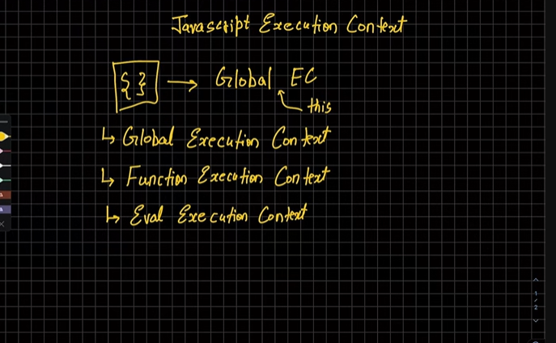
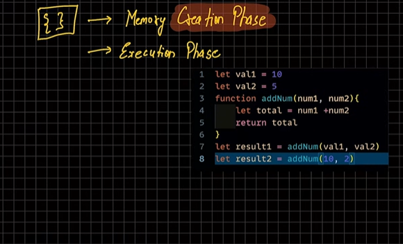
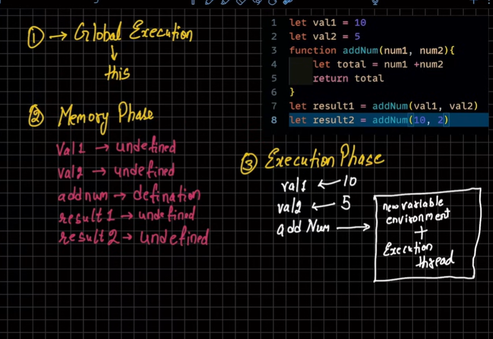
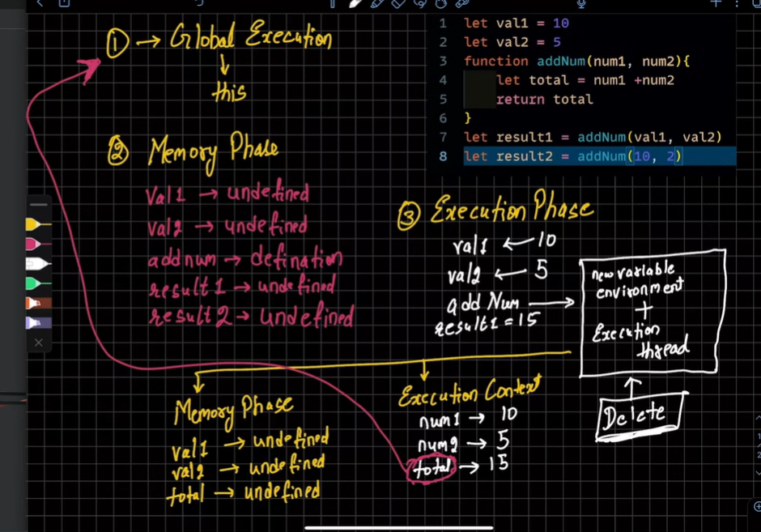
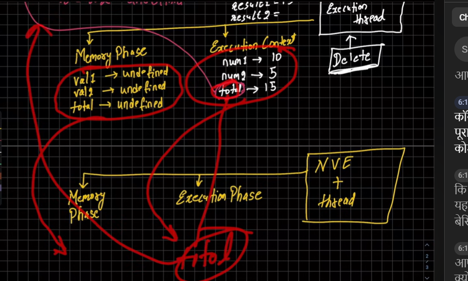
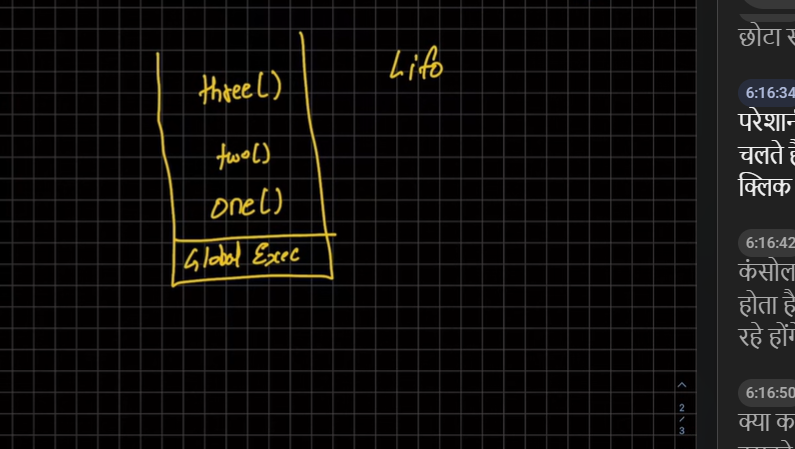

## For function 1 : 


## Similarly for another function 


## Call Stack (LIFO)




---
# Explanation 
---

# JavaScript Notes — How JavaScript Works Behind the Scenes

---

# JavaScript Execution Context

When JavaScript runs code, it creates an:

```javascript id="q7m2wp"
Execution Context
```

Execution Context = environment where JS code is executed.

---

# Types of Execution Context

| Type                       | Purpose                    |
| -------------------------- | -------------------------- |
| Global Execution Context   | created first              |
| Function Execution Context | created for every function |
| Eval Execution Context     | used by `eval()`           |

---

# 1. Global Execution Context (GEC)

This is created automatically when JS program starts.

---

# Important

In browser:

```javascript id="x4r8ty"
this === window
```

In Node.js:

```javascript id="v9m1qz"
this === {}
```

---

# Example

## Code

```javascript id="t5x7rk"
let val1 = 10
let val2 = 5

function addNum(num1, num2){
    let total = num1 + num2
    return total
}

let result1 = addNum(val1, val2)
let result2 = addNum(10, 2)
```

---

# JavaScript Executes Code in 2 Phases

---

# 1. Memory Creation Phase

Also called:

```javascript id="n8q3tw"
Creation Phase
```

Memory is allocated for variables and functions.

---

# What Happens?

| Variable/Function | Value in Memory     |
| ----------------- | ------------------- |
| `val1`            | `undefined`         |
| `val2`            | `undefined`         |
| `addNum`          | function definition |
| `result1`         | `undefined`         |
| `result2`         | `undefined`         |

---

# Visualization


---

# Important Rule

Functions are stored completely in memory during creation phase.

Variables declared using:

* `let`
* `var`

get:

```javascript id="m2x7qp"
undefined
```

initially.

---

# 2. Execution Phase

Now actual code executes line by line.

---

# Step-by-Step Execution

---

## Step 1

```javascript id="k5m9rz"
val1 = 10
```

---

## Step 2

```javascript id="u7m2qy"
val2 = 5
```

---

## Step 3

Function call:

```javascript id="d4x8pk"
addNum(val1, val2)
```

creates:

```javascript id="f9q3tw"
New Function Execution Context
```

---

# Function Execution Context (FEC)

Every function call gets its own separate execution context.

---

# Inside Function Context

For:

```javascript id="w3x7qk"
addNum(10,5)
```

memory becomes:

| Variable | Value       |
| -------- | ----------- |
| `num1`   | `10`        |
| `num2`   | `5`         |
| `total`  | `undefined` |

---

# Then Execution Happens

```javascript id="r8m2ty"
total = num1 + num2
```

↓

```javascript id="v5q9wp"
total = 15
```

↓

```javascript id="n1x4rz"
return total
```

↓

```javascript id="k1m6rp"
result1 = 15
```

---

# Important Point

After function completes:

```javascript id="c8x3qw"
Function Execution Context gets deleted
```

from memory.

---

# Same Process Repeats

For:

```javascript id="m5q7rz"
addNum(10,2)
```

new execution context is created again.

---

# Visualization of Execution Phase


---

# Eval Execution Context

Created when using:

```javascript id="t9m2wp"
eval()
```

---

# Example

```javascript id="u4x8pk"
eval("console.log(2+2)")
```

---

# Important

Rarely used in modern JavaScript.

Mostly avoided because:

* security risks
* performance issues

---

# Call Stack

JavaScript uses:

```javascript id="f2q7ty"
Call Stack
```

to manage execution contexts.

---

# Definition

Call Stack follows:

```javascript id="v6m1rz"
LIFO → Last In First Out
```

---

# Example

## Code

```javascript id="j3x9qp"
function one(){
    two()
}

function two(){
    three()
}

function three(){
    console.log("Prashant")
}

one()
```

---

# Execution Flow

---

## Step 1

Global Execution Context pushed into stack.

---

## Step 2

```javascript id="n8m4tw"
one()
```

added to stack.

---

## Step 3

```javascript id="w5q2rk"
two()
```

added to stack.

---

## Step 4

```javascript id="r1m7pz"
three()
```

added to stack.

---

## Step 5

`three()` finishes → removed from stack.

---

## Step 6

`two()` finishes → removed.

---

## Step 7

`one()` finishes → removed.

---

# Final Stack Order

```javascript id="x9q4tw"
Global()

one()

two()

three()
```

then pops in reverse order.

---

# Important Interview Points

---

# JavaScript is Single Threaded

Executes:

* one task at a time

using:

* Call Stack

---

# Every Function Call Creates New Execution Context

Each function gets:

* its own memory
* its own execution thread

---

# Memory Phase vs Execution Phase

| Memory Phase          | Execution Phase        |
| --------------------- | ---------------------- |
| memory allocation     | code execution         |
| variables → undefined | actual values assigned |
| functions stored      | functions executed     |

---

# Call Stack Uses LIFO

Last function added executes first.

---

# Quick Revision Table

| Concept         | Meaning                    |
| --------------- | -------------------------- |
| GEC             | Global Execution Context   |
| FEC             | Function Execution Context |
| Memory Phase    | allocate memory            |
| Execution Phase | execute code               |
| Call Stack      | manages execution contexts |
| LIFO            | Last In First Out          |

---

# Quick Revision Examples

```javascript id="k6m2ry"
function add(a,b){
   return a+b
}
```

creates:

* Memory Phase
* Execution Phase

---

```javascript id="b7x3qp"
one()
```

creates new Function Execution Context.

---

```javascript id="p4m8tw"
Call Stack
```

manages function execution order.

---

# Most Important Interview Question

## Why does JavaScript need Call Stack?

Because JavaScript is:

```javascript id="d2q7rz"
single threaded
```

and can execute only one thing at a time.


---
## Call Stack
---

# JavaScript Notes — Call Stack Explained with Example

---

# Code

```javascript id="q7m2wp"
function one(){
    console.log("one")
    two()
}

function two(){
    console.log("two")
    three()
}

function three(){
    console.log("three")
}

one()
two()
three()
```

---

# Output

```javascript id="x4r8ty"
one
two
three
two
three
three
```

---

# What is Call Stack?

Call Stack is a mechanism used by JavaScript to keep track of:

```javascript id="v9m1qz"
which function is currently executing
```

---

# Important Rule

Call Stack follows:

```javascript id="t5x7rk"
LIFO → Last In First Out
```

The last function added gets executed first.

---

# Step-by-Step Execution

---

# Step 1 → Global Execution Context (GEC)

When program starts:

```javascript id="n8q3tw"
Global Execution Context
```

is pushed into Call Stack.

---

# Call Stack

```javascript id="m2x7qp"
| Global() |
```

---

# Step 2 → `one()` Called

## Code

```javascript id="k5m9rz"
one()
```

---

# Stack

```javascript id="u7m2qy"
| one()    |
| Global() |
```

---

# Execution Inside `one()`

## Code

```javascript id="d4x8pk"
console.log("one")
```

---

# Output So Far

```javascript id="f9q3tw"
one
```

---

# Then

```javascript id="w3x7qk"
two()
```

gets called.

---

# Step 3 → `two()` Added

---

# Stack

```javascript id="r8m2ty"
| two()    |
| one()    |
| Global() |
```

---

# Execution Inside `two()`

## Code

```javascript id="v5q9wp"
console.log("two")
```

---

# Output So Far

```javascript id="n1x4rz"
one
two
```

---

# Then

```javascript id="k1m6rp"
three()
```

gets called.

---

# Step 4 → `three()` Added

---

# Stack

```javascript id="c8x3qw"
| three()  |
| two()    |
| one()    |
| Global() |
```

---

# Execution Inside `three()`

## Code

```javascript id="m5q7rz"
console.log("three")
```

---

# Output So Far

```javascript id="t9m2wp"
one
two
three
```

---

# Step 5 → `three()` Completes

`three()` removed from stack.

---

# Stack

```javascript id="u4x8pk"
| two()    |
| one()    |
| Global() |
```

---

# Step 6 → `two()` Completes

`two()` removed.

---

# Stack

```javascript id="f2q7ty"
| one()    |
| Global() |
```

---

# Step 7 → `one()` Completes

`one()` removed.

---

# Stack

```javascript id="v6m1rz"
| Global() |
```

---

# Step 8 → Next Line Executes

## Code

```javascript id="j3x9qp"
two()
```

---

# Stack

```javascript id="n8m4tw"
| two()    |
| Global() |
```

---

# Output

```javascript id="w5q2rk"
two
```

---

# Then `three()` gets called

---

# Stack

```javascript id="r1m7pz"
| three()  |
| two()    |
| Global() |
```

---

# Output

```javascript id="x9q4tw"
three
```

---

# Functions Complete One by One

Stack returns to:

```javascript id="k6m2ry"
| Global() |
```

---

# Step 9 → Last Function Call

## Code

```javascript id="b7x3qp"
three()
```

---

# Stack

```javascript id="p4m8tw"
| three()  |
| Global() |
```

---

# Output

```javascript id="d2q7rz"
three
```

---

# Final Output

```javascript id="t5m1wp"
one
two
three
two
three
three
```

---

# Complete Visualization of Stack Flow

---

# Initial

```javascript id="x8q4pk"
| Global() |
```

---

# `one()` Called

```javascript id="r9m2qy"
| one()    |
| Global() |
```

---

# `two()` Called

```javascript id="k3x7tw"
| two()    |
| one()    |
| Global() |
```

---

# `three()` Called

```javascript id="m6q1rz"
| three()  |
| two()    |
| one()    |
| Global() |
```

---

# Then Popping Starts

```javascript id="g4m9qp"
three() removed

two() removed

one() removed
```

---

# Important Interview Points

---

# JavaScript is Single Threaded

Only one function executes at a time.

---

# Call Stack Uses LIFO

Last function added:

* executes first
* removed first

---

# Every Function Call Creates

```javascript id="u1x7rk"
new execution context
```

---

# Stack Overflow

If functions keep calling infinitely:

```javascript id="v8q2tw"
Maximum call stack size exceeded
```

error occurs.

Example:

```javascript id="y4m7rz"
function demo(){
   demo()
}
```

---

# Quick Revision Table

| Concept | Meaning                  |
| ------- | ------------------------ |
| Push    | add function to stack    |
| Pop     | remove function          |
| LIFO    | Last In First Out        |
| GEC     | Global Execution Context |

---

# Quick Revision

```javascript id="z7m2pk"
one()
```

↓

```javascript id="h4x8tw"
two()
```

↓

```javascript id="c9q1rz"
three()
```

↓

functions removed in reverse order.
