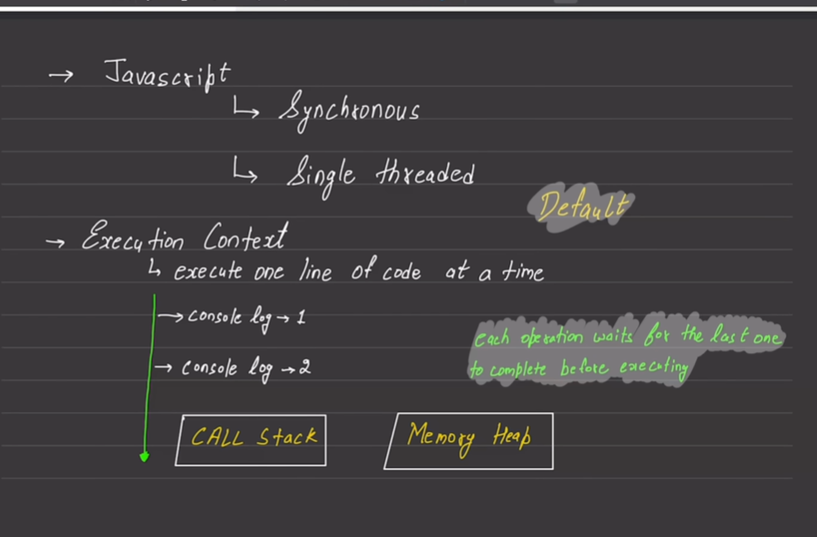
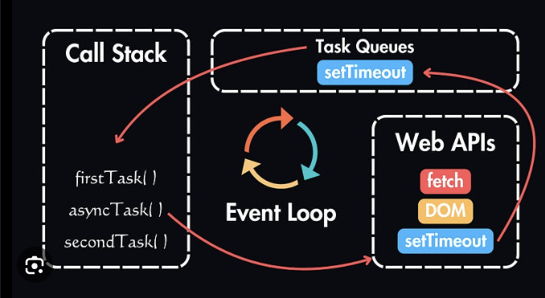
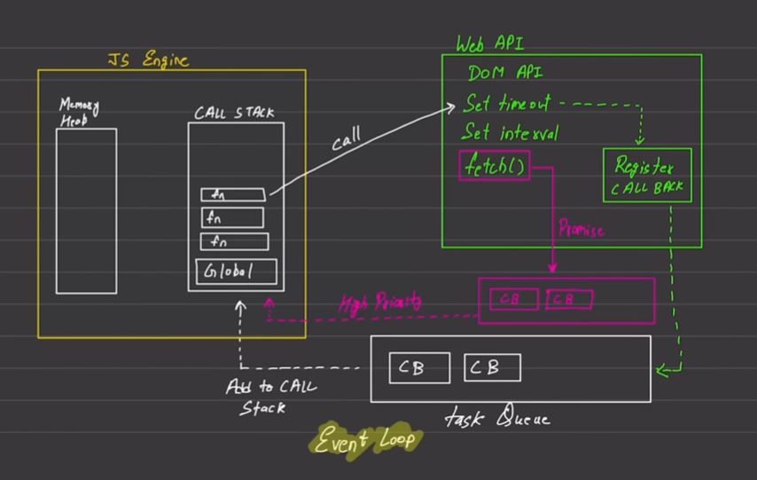

## JavaScript Runtime Foundations
By default, JavaScript is a synchronous and single-threaded programming language. This means it executes one command at a time in a specific, sequential order.
------------------------------
## Core Concepts Explained

* Single-Threaded: JavaScript has only one call stack. It can only handle one task or run one line of code at a time.
* Synchronous: Code runs from top to bottom. Each operation must wait for the previous one to finish before starting (console.log(1) finishes entirely before console.log(2) begins).
* Memory Heap: The large, unstructured region of memory where JavaScript allocates and stores variables, objects, and functions.
* Call Stack: The mechanism that tracks where the program is in the script. It pushes functions onto the stack when called and pops them off when completed.





# JavaScript Notes — Event Loop

The **Event Loop** is one of the most important concepts in JavaScript interviews.

It explains:

> How JavaScript can handle asynchronous operations (`setTimeout`, `fetch`, events, promises) even though JavaScript is single-threaded.

---

# First Understand the Components

From your diagram:

```text
┌─────────────────┐
│   Call Stack    │
└─────────────────┘

┌─────────────────┐
│    Web APIs     │
└─────────────────┘

┌─────────────────┐
│  Callback Queue │
└─────────────────┘

┌─────────────────┐
│ Microtask Queue │
└─────────────────┘

┌─────────────────┐
│   Event Loop    │
└─────────────────┘
```

---

# 1. Call Stack

JavaScript executes code using a stack.

Example:

```js
function one(){
    two();
}

function two(){
    console.log("Hello");
}

one();
```

Stack:

```text
Call Stack

one()
Global
```

then

```text
Call Stack

two()
one()
Global
```

then

```text
Hello
```

Functions are removed after execution.

---

# 2. Web APIs

JavaScript itself cannot perform:

* setTimeout
* DOM events
* fetch
* setInterval

These are provided by the browser.

Example:

```js
setTimeout(() => {
    console.log("Hi");
}, 2000);
```

Browser stores this timer inside Web APIs.

```text
Web APIs

setTimeout()
```

---

# 3. Callback Queue (Task Queue)

When a timer completes:

```js
setTimeout(() => {
    console.log("Hi");
}, 2000);
```

The callback does NOT go directly to Call Stack.

It first enters:

```text
Callback Queue

console.log("Hi")
```

---

# 4. Event Loop

The Event Loop continuously checks:

```text
Is Call Stack Empty?
```

If yes:

```text
Move callback from queue → Call Stack
```

---

# Complete Flow Example

```js
console.log("Start");

setTimeout(() => {
    console.log("Timer");
}, 2000);

console.log("End");
```

---

## Step 1

```js
console.log("Start");
```

Output:

```text
Start
```

---

## Step 2

```js
setTimeout(...)
```

Moves to Web API:

```text
Web API

Timer (2s)
```

---

## Step 3

```js
console.log("End");
```

Output:

```text
End
```

---

After 2 seconds:

```text
Callback Queue

console.log("Timer")
```

---

Event Loop checks:

```text
Call Stack Empty?
```

Yes.

Moves callback to stack.

Output:

```text
Timer
```

---

# Final Output

```text
Start
End
Timer
```

---

# Why setTimeout(0) Doesn't Run Immediately

Example:

```js
console.log(1);

setTimeout(() => {
    console.log(2);
}, 0);

console.log(3);
```

---

Execution:

```text
1
```

Timer goes to Web API.

```text
3
```

Timer callback enters Callback Queue.

Event Loop waits for stack to become empty.

Then:

```text
2
```

---

Output:

```text
1
3
2
```

---

# Microtask Queue (Very Important)

Your diagram shows the pink queue.

This is the:

```text
Microtask Queue
```

Used by:

* Promises
* queueMicrotask()
* MutationObserver

---

Example:

```js
console.log(1);

Promise.resolve().then(() => {
    console.log(2);
});

console.log(3);
```

---

Execution:

```text
1
3
```

Promise callback goes to:

```text
Microtask Queue
```

---

Event Loop Rule:

```text
Microtask Queue
      ↑
Higher Priority

Callback Queue
      ↓
Lower Priority
```

---

Then:

```text
2
```

Output:

```text
1
3
2
```

---

# Promise vs setTimeout

Interview Favorite ⭐

```js
console.log(1);

setTimeout(() => {
    console.log(2);
}, 0);

Promise.resolve().then(() => {
    console.log(3);
});

console.log(4);
```

---

Step-by-step:

```text
1
```

Timer → Web API

Promise → Microtask Queue

```text
4
```

Now stack becomes empty.

Event Loop checks:

```text
Microtask Queue first
```

Runs:

```text
3
```

Then:

```text
2
```

---

Final Output

```text
1
4
3
2
```

---

# Event Loop Algorithm

Think of it like:

```text
while(true){

    if(CallStack is empty){

        Execute ALL Microtasks

        Execute ONE Task from Callback Queue

    }

}
```

---

# Complete Diagram

```text
                Browser

          ┌─────────────┐
          │  Web APIs   │
          └──────┬──────┘
                 │
                 ▼
        ┌──────────────────┐
        │ Callback Queue   │
        └──────────────────┘

                 ▲

        ┌──────────────────┐
        │ Microtask Queue  │
        └──────────────────┘

                 ▲
                 │
          Event Loop
                 │
                 ▼

        ┌──────────────────┐
        │   Call Stack     │
        └──────────────────┘
```

---

# Interview Summary

### Event Loop

A mechanism that continuously monitors the Call Stack and moves ready callbacks from queues to the Call Stack when it becomes empty.

### Priority Order

```text
1. Call Stack

2. Microtask Queue
   (Promises)

3. Callback Queue
   (setTimeout, Events)
```

### Important Outputs

```js
console.log(1);

setTimeout(() => console.log(2), 0);

console.log(3);
```

Output:

```text
1
3
2
```

---

```js
console.log(1);

Promise.resolve().then(() => console.log(2));

console.log(3);
```

Output:

```text
1
3
2
```

---

```js
console.log(1);

setTimeout(() => console.log(2), 0);

Promise.resolve().then(() => console.log(3));

console.log(4);
```

Output:

```text
1
4
3
2
```

**Reason:** Promises (Microtask Queue) always execute before `setTimeout` callbacks (Task Queue).


---

## Important Question : 

consider : 

console.log(1)
setTimeout(() => {
    console.log(2)
} , 0)
console.log(3)

what will be printed : 1       1
                       2  or   3
                       3       2

---
The output will be:

```js
1
3
2
```

---

## Why?

Code:

```js
console.log(1)

setTimeout(() => {
    console.log(2)
}, 0)

console.log(3)
```

Many beginners think:

```text
1
2
3
```

because the timeout is `0 ms`.

But that's **not how JavaScript works**.

---

# Step 1: Global Execution Starts

```js
console.log(1)
```

Output:

```text
1
```

Call Stack:

```text
console.log()
Global
```

After execution:

```text
Global
```

---

# Step 2: setTimeout()

```js
setTimeout(() => {
    console.log(2)
}, 0)
```

When JS sees `setTimeout`:

1. It registers the callback with the **Web API**
2. Timer starts (0 ms)
3. JS DOES NOT wait

So the callback goes outside the Call Stack.

```text
Call Stack            Web API

Global                setTimeout(cb,0)
```

---

# Step 3: Next Line Executes

```js
console.log(3)
```

Output:

```text
1
3
```

Call Stack:

```text
console.log()
Global
```

---

# Step 4: Timer Completes

The timer is already finished because:

```js
0 ms
```

But the callback **cannot directly enter the Call Stack**.

Instead it goes to the **Task Queue**.

```text
Task Queue

console.log(2)
```

---

# Step 5: Event Loop Checks

The Event Loop continuously asks:

```text
"Is Call Stack empty?"
```

Now:

```text
Call Stack

Global
```

Global execution finishes.

```text
Call Stack

(empty)
```

---

# Step 6: Callback Moves to Call Stack

Event Loop moves callback from Task Queue to Call Stack.

```text
Call Stack

console.log(2)
```

Output:

```text
2
```

---

# Final Output

```text
1
3
2
```

---

# Important Rule

`setTimeout(fn, 0)` means:

> "Execute this callback **as soon as the Call Stack becomes empty**."

It does **NOT** mean:

> "Execute immediately."

---

## Visualization

```text
1) console.log(1)
Output: 1

2) setTimeout(...)
Web API gets callback

3) console.log(3)
Output: 3

4) Callback → Task Queue

5) Call Stack empty?

YES

6) Event Loop pushes callback

Output: 2
```

Final:

```text
1
3
2
```

---

### Interview Question

What is the output?

```js
console.log("A")

setTimeout(() => {
    console.log("B")
}, 0)

console.log("C")
```

Answer:

```text
A
C
B
```

because **Web APIs + Task Queue + Event Loop** always wait for the Call Stack to become empty before executing callbacks.


