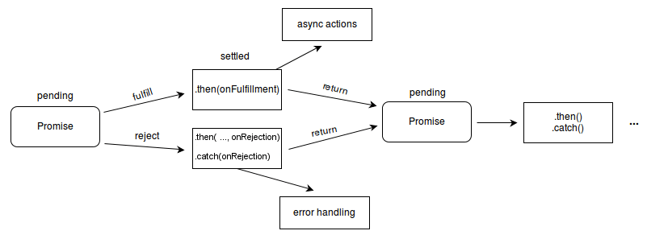

# Promise

The Promise object represents the eventual completion (or failure) of an asynchronous operation and its resulting value.

A Promise is an object representing the eventual completion or failure of an asynchronous operation. Since most people are consumers of already-created promises, this guide will explain consumption of returned promises before explaining how to create them.

**A Promise is in one of these states:**

* **__pending:__** initial state, neither fulfilled nor rejected.
* **__fulfilled:__** meaning that the operation was completed successfully.
* **__rejected:__** meaning that the operation failed.

## A promise is said to be settled if it is either fulfilled or rejected, but not pending.

