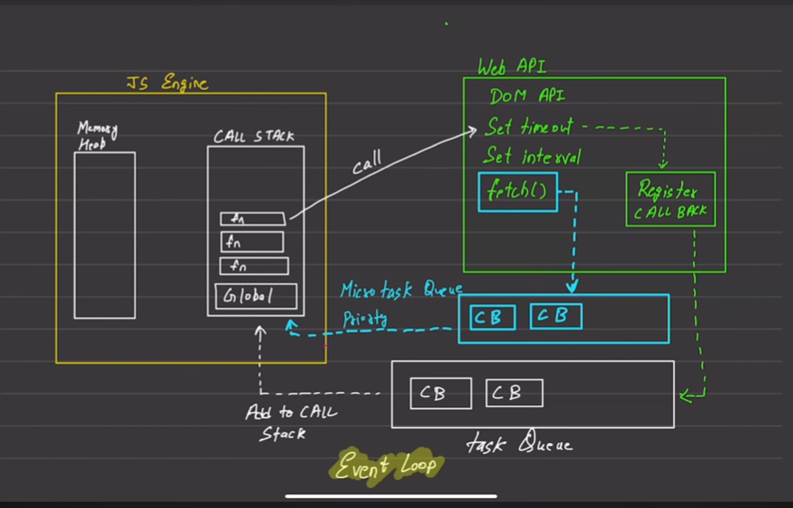
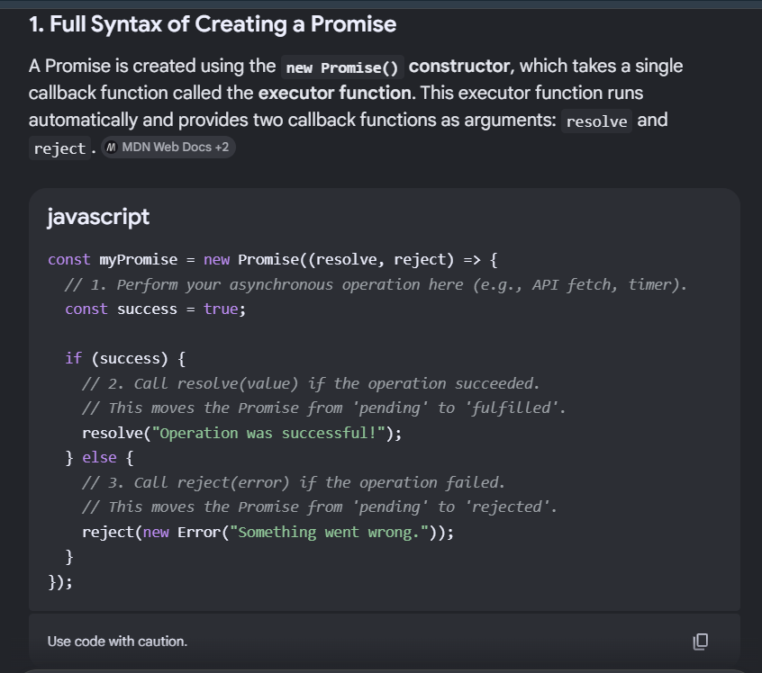
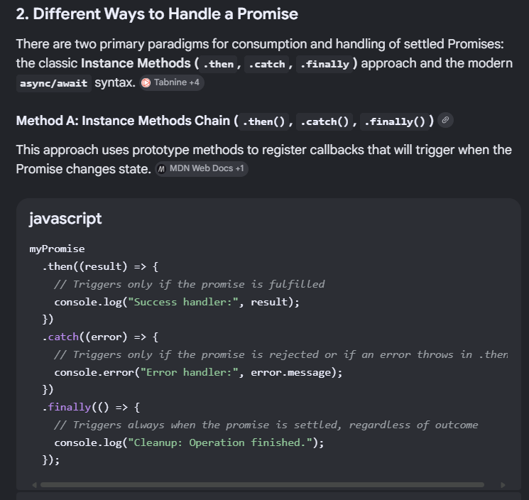
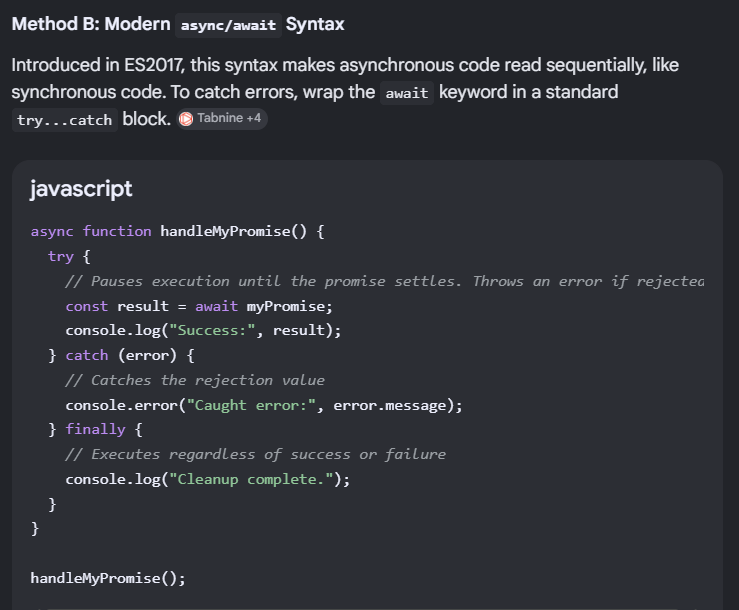
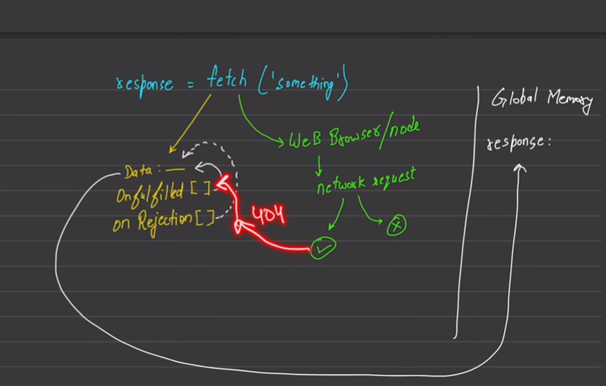

This is a very common interview question, and the answer lies in the **Event Loop**, **Web APIs**, and **Microtask Queue vs Callback Queue**.

---

## First, understand your code

You have:

```js
// Promise 1
setTimeout(() => {
    console.log("Asynchronous task is completed")
}, 1000)

// Fetch API
fetch("https://jsonplaceholder.typicode.com/users")
    .then(response => response.json())
    .then(data => console.log(data))
```

Many people expect:

```text
Asynchronous task is completed
[API Data]
```

But often you see:

```text
[API Data]
Asynchronous task is completed
```

even though both have a delay.

---

# The reason: Promise callbacks have higher priority

JavaScript has **two queues**:

### 1. Microtask Queue (High Priority)

Contains:

* Promise `.then()`
* `.catch()`
* `.finally()`
* `async/await`

Example:

```js
Promise.resolve().then(() => {
    console.log("Promise");
});
```

---

### 2. Callback Queue / Task Queue (Low Priority)

Contains:

* setTimeout
* setInterval
* DOM events

Example:

```js
setTimeout(() => {
    console.log("Timeout");
}, 0);
```

---

# Event Loop Rule

When Call Stack becomes empty:

### Step 1

Execute **ALL Microtasks**

### Step 2

Execute one Task from Callback Queue

So:

```text
Microtask Queue
       ↑
Higher Priority

Callback Queue
       ↑
Lower Priority
```

---

# Example

```js
console.log("Start");

setTimeout(() => {
    console.log("Timeout");
}, 0);

Promise.resolve().then(() => {
    console.log("Promise");
});

console.log("End");
```

Output:

```text
Start
End
Promise
Timeout
```

Why?

```text
Call Stack:
Start
End

Microtask Queue:
Promise

Callback Queue:
Timeout
```

Event Loop checks:

```text
Stack Empty?
YES

Run all microtasks first
=> Promise

Then callback queue
=> Timeout
```

---

# Now Let's Apply This To Fetch

When you do:

```js
fetch(url)
```

the request goes to the browser's Web API.

```text
JS Engine
   |
   |
 fetch()
   |
   ↓
Browser/Web API
```

The browser starts the network request.

Meanwhile JS continues running.

---

When the response arrives:

```js
.then(...)
```

is not placed in the Callback Queue.

It is placed in the:

```text
Microtask Queue
```

because Promise callbacks are microtasks.

---

# Meanwhile setTimeout

```js
setTimeout(() => {
   console.log("Done")
},1000)
```

After 1 second:

```text
Callback Queue
    ↓
"Done"
```

---

# Event Loop Decision

Suppose at some moment:

```text
Microtask Queue:
fetch .then()

Callback Queue:
setTimeout callback
```

Event Loop always does:

```text
1. Execute all Microtasks
2. Execute Callback Queue
```

So:

```text
fetch data printed
then
setTimeout printed
```

---

# Visual Diagram

```text
              ┌──────────────┐
              │ Call Stack   │
              └──────┬───────┘
                     │
                     ▼
              ┌──────────────┐
              │ Event Loop   │
              └──────┬───────┘
                     │
         ┌───────────┴───────────┐
         ▼                       ▼

 ┌────────────────┐     ┌────────────────┐
 │ Microtask Queue│     │ Callback Queue │
 │ Promise.then() │     │ setTimeout()   │
 │ async/await    │     │ setInterval()  │
 └────────────────┘     └────────────────┘

      Higher Priority        Lower Priority
```

---

# Another Important Example

```js
console.log(1);

setTimeout(() => {
    console.log(2);
}, 0);

Promise.resolve().then(() => {
    console.log(3);
});

console.log(4);
```

Output:

```text
1
4
3
2
```

Execution:

```text
Call Stack:
1
4

Microtask Queue:
3

Callback Queue:
2

Event Loop:
3 first
2 later
```

---

# One correction in your notes

You wrote:

```js
console.log() is given by v8 engine
```

Not exactly.

`console.log()` is usually provided by the **host environment**:

* Browser → Web APIs / DevTools
* Node.js → Node runtime

V8 executes JavaScript, but `console.log()` itself is not part of the ECMAScript language specification.

---

## Interview Summary

When asked:

> Why is API data printed before `"Asynchronous task is completed"`?

Answer:

> `fetch()` returns a Promise. Promise callbacks (`then`, `catch`, `finally`) are placed in the **Microtask Queue**, while `setTimeout` callbacks are placed in the **Callback Queue**. The Event Loop always processes the Microtask Queue completely before taking tasks from the Callback Queue. Therefore, the fetch result is often printed before the `setTimeout` callback, even when both are asynchronous.



---
---



---



---



---

## fetch() :

The `fetch()` method of the Window interface starts the process of fetching a resource from the network, returning a promise that is fulfilled once the response is available.

The promise resolves to the Response object representing the response to your request.

A fetch() promise only rejects when the request fails, for example, because of a badly-formed request URL or a network error. A fetch() promise does not reject if the server responds with HTTP status codes that indicate errors (404, 504, etc.). Instead, a then() handler must check the Response.ok and/or Response.status properties.


# How fetch() works ? 


This diagram is actually showing one of the most important concepts about `fetch()`:

> **`fetch()` immediately returns a Promise object before the network request finishes.**

Let's walk through it step by step.

---

# Step 1: JS encounters fetch()

```js
const response = fetch("something");
```

When this line executes:

```js
fetch("something")
```

JavaScript **does not wait** for the network request.

Instead:

1. Creates a Promise object.
2. Starts the network request in Browser/Node APIs.
3. Immediately returns the Promise.

```text
JS Engine
    |
    |
fetch()
    |
    +--------------------+
                         |
                         ▼
                   Promise Object
```

So:

```js
console.log(response);
```

prints:

```js
Promise { <pending> }
```

---

# Step 2: Promise is stored in memory

Your diagram's right side:

```text
Global Memory

response:
   ↑
 Promise
```

means:

```js
const response = fetch(...)
```

stores a reference to the Promise object.

Initially:

```js
Promise {
   state: pending
}
```

---

# Step 3: Browser handles network request

The green part:

```text
Web Browser / Node
      ↓
Network Request
```

means:

```js
fetch()
```

delegates the actual HTTP request to the browser (or Node runtime).

JavaScript itself doesn't perform networking.

The browser does.

```text
JS Thread
    |
    |----> Browser API
                |
                |----> Send HTTP Request
```

Meanwhile JS continues executing other code.

---

# Step 4: Promise contains hidden callback lists

The yellow box in your diagram:

```text
Data
OnFulfilled[]
OnRejected[]
```

represents internal Promise structures.

When you write:

```js
fetch(url)
    .then(successHandler)
    .catch(errorHandler);
```

internally:

```text
Promise
|
|-- OnFulfilled[]
|      successHandler
|
|-- OnRejected[]
       errorHandler
```

The Promise stores these callbacks.

---

# Step 5: Server responds

Suppose the request succeeds:

```http
200 OK
```

Browser receives:

```text
Response Data
```

and updates Promise:

```text
Pending
   ↓
Fulfilled
```

```js
Promise {
   state: "fulfilled",
   value: response
}
```

---

# Step 6: Callback enters Microtask Queue

Now the Promise sees:

```js
.then(successHandler)
```

registered earlier.

It pushes:

```text
successHandler
```

into the:

```text
Microtask Queue
```

NOT Callback Queue.

This is why Promises are fast.

---

# Step 7: Event Loop executes callback

When Call Stack becomes empty:

```text
Microtask Queue
     ↓
successHandler
```

runs.

```js
.then(response => {
    console.log(response);
});
```

gets executed.

---

# What about 404?

Your diagram highlights:

```text
404
```

This is where many beginners get confused.

People think:

```js
404 => catch()
```

But that's not how fetch works.

---

## Case 1: Network request succeeds

Even if the server returns:

```http
404 Not Found
```

the network request itself succeeded.

So:

```js
fetch("/wrong-url")
```

returns:

```js
Promise => fulfilled
```

not rejected.

Example:

```js
fetch("/wrong-url")
.then(response => {
    console.log(response.status);
});
```

Output:

```js
404
```

and `.catch()` does NOT run.

---

## Case 2: Network failure

Suppose:

* Internet disconnected
* DNS failure
* Server unreachable

Now:

```text
Network Request Failed
```

Promise becomes:

```text
Rejected
```

and:

```js
.catch()
```

runs.

Example:

```js
fetch("https://invalid-domain.xyz")
.catch(err => {
    console.log(err);
});
```

---

# Why do we use response.json()?

When fetch resolves:

```js
const response = await fetch(url);
```

you don't get actual JSON.

You get a Response object:

```js
Response {
   status: 200,
   headers: ...
}
```

To extract JSON:

```js
const data = await response.json();
```

Internally:

```text
Response
   ↓
Read Body
   ↓
Parse JSON
   ↓
Return another Promise
```

That's why:

```js
await response.json()
```

needs another `await`.

---

# Complete Flow

```text
fetch(url)
    |
    ▼
Create Promise (Pending)
    |
    ▼
Store Promise in Memory
    |
    ▼
Browser starts HTTP request
    |
    ▼
Request sent to server
    |
    ▼
Server responds
    |
    ├── Success (200,404,500...)
    │       ▼
    │   Promise Fulfilled
    │       ▼
    │   .then() callback
    │       ▼
    │   Microtask Queue
    │
    └── Network Failure
            ▼
        Promise Rejected
            ▼
        .catch() callback
            ▼
        Microtask Queue
```

### Interview Answer (Short)

> `fetch()` immediately returns a pending Promise and delegates the HTTP request to browser/Node APIs. The Promise stores fulfillment and rejection callbacks registered through `.then()` and `.catch()`. When the network operation completes, the Promise is settled (fulfilled or rejected), and the corresponding callback is placed into the Microtask Queue. The Event Loop later executes these callbacks when the Call Stack is empty. A 404 response does not reject the Promise because the network request succeeded; only actual network failures reject the Promise.
