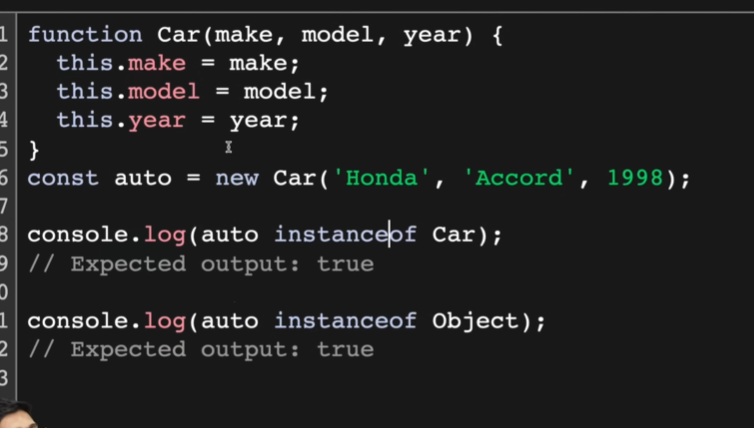

# Code : 

```js

// Object literal

const user = {
    username: "john",  // properties
    loginCount: 8,
    signedIn: true,

    getUserDetails: function () {
        console.log("Got user details from database")

        // console.log(username)  // username not defined 

        console.log(this.username);   // john

        console.log(this);
        // Output :

        // {
        //     username: 'john',
        //     loginCount: 8,
        //     signedIn: true,
        //     getUserDetails: [Function: getUserDetails]
        // }

        console.log(`Username : ${this.username}, Login Count : ${this.loginCount}, Signed In : ${this.signedIn}`)
    }
}

console.log(user.username) // Output : john
console.log(user.getUserDetails()) // Output : Username : john, Login Count : 8, Signed In : true

// console.log(this);   // {}

// for browser it is a window object 


// new Keyword


// here new keyword is actually a constructor function
// const promiseOne = new Promise()
// const date = new Date()


function User(username , loginCount , isLoggedIn){

    this.username = username;
    this.loginCount = loginCount;
    this.isLoggedIn = isLoggedIn;

    this.greetings = function(){
        console.log(`welcome ${this.username}`);
        
    }

    return this
}

// const userOne = User("Prashant" , 12 , true);
// const userTwo = User("user2" , 11 , false);   

// console.log(userOne);  // unexpected behavoiur , values of user1 is overridden by user2

// Solution to this?
// Just add a 'new' keyword

// 'new' => when we use 'new' keyword , an empty object is created , then a constructor function is called , arguments injected inside this 

const userOne = new User("Prashant" , 12 , true);
const userTwo = new User("user2" , 11 , false);  

console.log(userOne);  // User { username: 'Prashant', loginCount: 12, isLoggedIn: true }
console.log(userTwo);  // User { username: 'user2', loginCount: 11, isLoggedIn: false }


console.log(userOne.constructor);  // [Function: User]


// instanceof()


```
---------------------------------------------
---
---

This topic is introducing two very important OOP concepts in JavaScript:

1. **Object Literals**
2. **Constructor Functions + `new` Keyword**

---

# 1. Object Literal

```js
const user = {
    username: "john",
    loginCount: 8,
    signedIn: true,

    getUserDetails: function () {
        console.log(this.username);
    }
}
```

This creates **one object directly**.

Memory:

```text
user
 │
 ▼
{
 username: "john",
 loginCount: 8,
 signedIn: true,
 getUserDetails: fn()
}
```

Accessing:

```js
console.log(user.username);
```

Output:

```text
john
```

---

# Why `this.username` works?

Inside:

```js
getUserDetails: function () {
    console.log(this.username);
}
```

`this` refers to the object that called the method.

```js
user.getUserDetails()
```

means:

```js
this === user
```

Therefore:

```js
this.username
```

becomes:

```js
user.username
```

Output:

```text
john
```

---

# Why doesn't this work?

```js
console.log(username);
```

Output:

```text
ReferenceError: username is not defined
```

Because JavaScript searches:

```text
Current Function Scope
↓
Outer Scope
↓
Global Scope
```

but `username` is inside the object, not in any scope variable.

You must use:

```js
this.username
```

or

```js
user.username
```

---

# What is `this` here?

```js
console.log(this);
```

inside:

```js
user.getUserDetails()
```

prints:

```js
{
  username: 'john',
  loginCount: 8,
  signedIn: true,
  getUserDetails: [Function]
}
```

because:

```js
this === user
```

---

# Constructor Functions

Suppose you want many users:

```js
User 1
User 2
User 3
User 4
```

Creating objects manually:

```js
const user1 = { ... }
const user2 = { ... }
const user3 = { ... }
```

is repetitive.

So we create a blueprint:

```js
function User(username, loginCount, isLoggedIn) {
    this.username = username;
    this.loginCount = loginCount;
    this.isLoggedIn = isLoggedIn;
}
```

---

# Problem without `new`

Consider:

```js
const userOne = User("Prashant",12,true);
```

What happens?

When a normal function executes:

```js
this
```

points to:

```text
Global Object
```

In Node:

```js
global
```

In Browser:

```js
window
```

So:

```js
this.username = "Prashant";
```

actually becomes:

```js
window.username = "Prashant";
```

or

```js
global.username = "Prashant";
```

---

Then:

```js
const userTwo = User("user2",11,false);
```

overwrites those same properties.

Result:

```text
username = user2
loginCount = 11
```

That's why userOne gets "overwritten".

---

# Solution: `new`

```js
const userOne = new User("Prashant",12,true);
```

Now JavaScript performs 4 steps.

---

## Step 1: Create Empty Object

```js
{}
```

---

## Step 2: Bind `this`

```js
this = {}
```

inside the function.

---

## Step 3: Execute Constructor

```js
this.username = "Prashant"
this.loginCount = 12
this.isLoggedIn = true
```

Object becomes:

```js
{
 username: "Prashant",
 loginCount: 12,
 isLoggedIn: true
}
```

---

## Step 4: Return Object Automatically

Even if you don't write:

```js
return this
```

JavaScript does it automatically.

So:

```js
const userOne = new User(...)
```

gets:

```js
{
 username: "Prashant",
 loginCount: 12,
 isLoggedIn: true
}
```

---

# Visual Representation

```text
new User("Prashant",12,true)

        │
        ▼

   Create {}

        │
        ▼

 this → {}

        │
        ▼

 username = "Prashant"
 loginCount = 12
 isLoggedIn = true

        │
        ▼

 Return object

        │
        ▼

userOne
```

---

# Multiple Objects

```js
const userOne = new User("Prashant",12,true);
const userTwo = new User("user2",11,false);
```

Memory:

```text
userOne
   │
   ▼
{
 username: "Prashant",
 loginCount: 12
}

userTwo
   │
   ▼
{
 username: "user2",
 loginCount: 11
}
```

Now they are completely independent.

---

# `constructor` Property

```js
console.log(userOne.constructor);
```

Output:

```js
[Function: User]
```

Every object created by a constructor remembers:

> "Which constructor created me?"

So:

```js
userOne.constructor === User
```

returns:

```js
true
```

---

# `instanceof`

This is commonly asked in interviews.

```js
console.log(userOne instanceof User);
```

Output:

```text
true
```

because:

```text
userOne
   ↓
created using
   ↓
User constructor
```

Example:

```js
console.log([] instanceof Array); // true
console.log({} instanceof Object); // true
console.log(new Date() instanceof Date); // true
```

---

## One Improvement

In your code:

```js
this.greetings = function(){
    console.log(`welcome ${this.username}`);
}
```

A new function is created for every user.

If you create 10,000 users:

```text
10,000 greeting functions
```

which wastes memory.

Later you'll learn **prototypes**, where the function is shared:

```js
User.prototype.greetings = function () {
    console.log(`welcome ${this.username}`);
};
```

Now all users use the same function instance.

---

### Interview Summary

**What does `new` do?**

1. Creates a new empty object `{}`.
2. Sets `this` to that object.
3. Executes the constructor function.
4. Automatically returns the new object.

Without `new`, `this` points to the global object (or is `undefined` in strict mode), which causes unexpected behavior.


