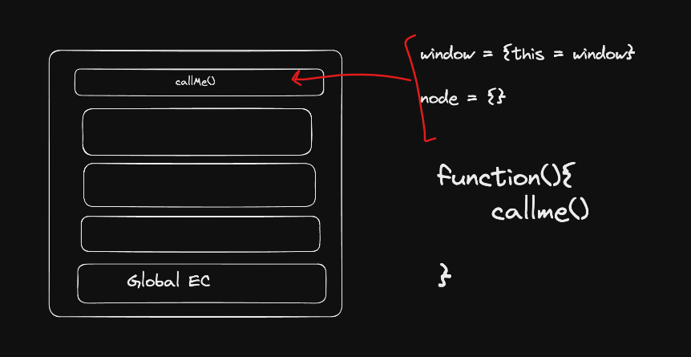

---
# Code
---

```js

function setUserName(username) {
    
    // complex DB calls
    this.username = username
    console.log("called");
    
}

function createUser(username , email , password){

    // this.username = username;
    setUserName(username);    // this doesn't work

    
    setUserName.call(username)  // createUser { email: 'chai@fb.com', password: '123' }

    // correct
    setUserName.call(this , username);  // { username: 'chai', email: 'chai@fb.com', password: '123' }

    this.email = email;
    this.password = password;
}

const chai = new createUser("chai" , "chai@fb.com" , "123")
console.log(chai);  // createUser { email: 'chai@fb.com', password: '123' }                                                                                                                             
 
```


This example is teaching one of the most important concepts in JavaScript:

# Why `call()` is needed

Let's understand step by step.

---

## Step 1: `setUserName()`

```js
function setUserName(username) {
    this.username = username
    console.log("called");
}
```

This function expects that `this` points to some object.

Example:

```js
const obj = {}

setUserName.call(obj, "Prashant")

console.log(obj)
```

Output:

```js
{
  username: "Prashant"
}
```

Because:

```js
this === obj
```

inside `setUserName()`.

---

# Step 2: Without `call()`

Suppose we write:

```js
function createUser(username, email, password){

    setUserName(username)

    this.email = email
    this.password = password
}
```

and

```js
const chai = new createUser(
    "chai",
    "chai@fb.com",
    "123"
)

console.log(chai)
```

---

### What happens?

When JS executes:

```js
setUserName(username)
```

it is a normal function call.

So JS creates a separate execution context:

```text
createUser context
        |
        └── setUserName context
```

Inside `setUserName()`:

```js
this.username = username
```

`this` is NOT the object being created by `new createUser()`.

The value gets assigned somewhere else (global object in non-strict mode, undefined/error in strict mode).

After `setUserName()` finishes:

```text
setUserName execution context destroyed
```

The `username` assignment is lost from the object you're building.

Therefore:

```js
console.log(chai)
```

becomes

```js
{
   email: "chai@fb.com",
   password: "123"
}
```

No username.

---

# Visualization

Without `call()`

```text
new createUser()

createUser context
│
├── this = {}
│
├── setUserName("chai")
│     │
│     └── own this
│
├── email added
└── password added
```

Result:

```js
{
   email: "...",
   password: "..."
}
```

---

# Step 3: Wrong `call()`

You wrote:

```js
setUserName.call(username)
```

This means:

```js
this = username
```

So:

```js
this = "chai"
```

inside the function.

Not what we want.

---

# Step 4: Correct `call()`

```js
setUserName.call(this, username)
```

This is the important line.

---

`call()` syntax:

```js
functionName.call(thisArg, arg1, arg2, ...)
```

So:

```js
setUserName.call(this, username)
```

means:

```js
Inside setUserName,

this = createUser's this
```

---

## What is createUser's `this`?

Because of:

```js
const chai = new createUser(...)
```

JS creates:

```js
{}
```

and sets:

```js
this = {}
```

inside `createUser`.

---

Now:

```js
setUserName.call(this, username)
```

becomes:

```js
setUserName.call({}, "chai")
```

---

Inside `setUserName`:

```js
this.username = username
```

becomes:

```js
{}.username = "chai"
```

---

Now the object contains:

```js
{
   username: "chai"
}
```

Then:

```js
this.email = email
this.password = password
```

adds more properties.

---

Final object:

```js
{
   username: "chai",
   email: "chai@fb.com",
   password: "123"
}
```

Output:

```js
createUser {
  username: 'chai',
  email: 'chai@fb.com',
  password: '123'
}
```

---

# Internal Flow

```text
new createUser()
        │
        ▼

Empty Object Created
{}
        │
        ▼

this → {}
        │
        ▼

setUserName.call(this, "chai")
        │
        ▼

setUserName executes with

this → {}
        │
        ▼

{}.username = "chai"
        │
        ▼

returns
        │
        ▼

email added
password added
        │
        ▼

return object
```

---

# Interview Definition

`call()` is used to **explicitly set the value of `this` while invoking a function**.

```js
fn.call(thisArg, arg1, arg2)
```

In your example:

```js
setUserName.call(this, username)
```

allows `setUserName()` to reuse the current object's `this`, so the `username` property is added to the same object being created by `new createUser()`.
