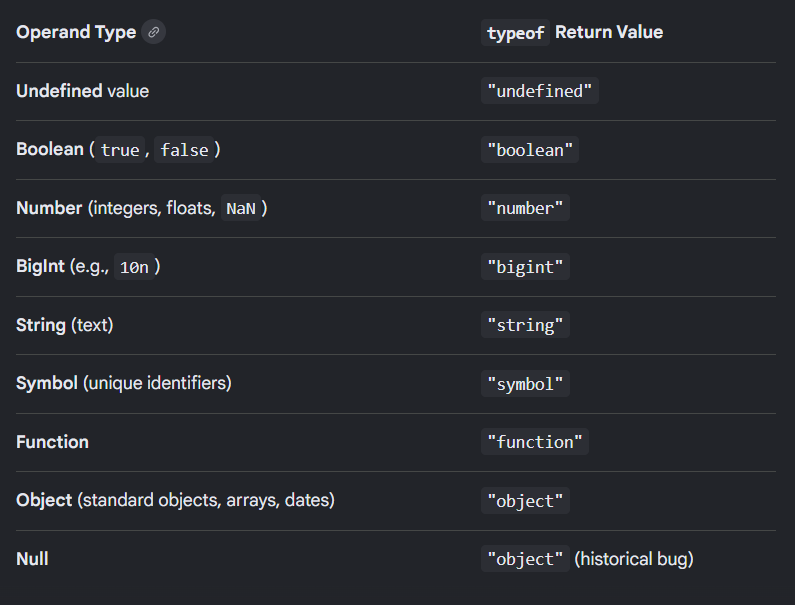
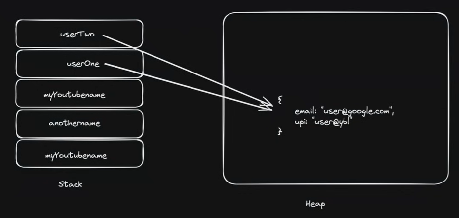

# JavaScript Notes — Datatypes Summary

---

# JavaScript Datatypes

JavaScript datatypes are divided into 2 categories:

1. Primitive Datatypes
2. Reference (Non-Primitive) Datatypes

---

# 1. Primitive Datatypes

Primitive datatypes store single/simple values.

## 7 Primitive Types

| Datatype  | Example         |
| --------- | --------------- |
| String    | `"Prashant"`    |
| Number    | `100`           |
| Boolean   | `true`          |
| Null      | `null`          |
| Undefined | `undefined`     |
| Symbol    | `Symbol('123')` |
| BigInt    | `123456789n`    |

---

# Examples

## String

```javascript id="y8r4pw"
const name = "Prashant"
```

---

## Number

```javascript id="m4q7tx"
const score = 100
const scoreValue = 100.3
```

Both integer and decimal are `number` type in JavaScript.

---

## Boolean

```javascript id="x5k2zn"
const isLoggedIn = false
```

Possible values:

* `true`
* `false`

---

## Null

```javascript id="r7m9qb"
const tempOutside = null
```

Represents an intentionally empty value.

---

## Undefined

```javascript id="v3x8kp"
let userEmail
```

Variable declared but value not assigned.

---

# Symbol

Used to create unique values.

## Code

```javascript id="n1q6tw"
const id = Symbol('123')
const anotherId = Symbol('123')

console.log(id === anotherId);
```

---

# Output

```javascript id="p5m8zr"
false
```

---

# Explanation

Even if symbols contain same value:

```javascript id="g2x7vy"
Symbol('123')
```

they are always unique.

---

# BigInt

Used for very large numbers.

## Code

```javascript id="k8v4tp"
const bigNumber = 234332423242423333333n
```

---

# Important

`n` at end means:

```javascript id="z4m1qx"
BigInt
```

---

# 2. Reference (Non-Primitive) Datatypes

Reference types store collections or complex data.

---

# Types of Reference Datatypes

| Datatype | Example              |
| -------- | -------------------- |
| Array    | `["A", "B"]`         |
| Object   | `{name: "Prashant"}` |
| Function | `function(){}`       |

---

# Array

## Code

```javascript id="u7q2mk"
const heroes = ["A", "B", "C"]
```

Stores multiple values in a single variable.

---

# Object

## Code

```javascript id="j5r9xn"
let myObj = {
    name: "prashant",
    age: 21,
}
```

Stores data in `key : value` form.

---

# Function

## Code

```javascript id="f8m3qp"
const myFunction = function (){
    console.log("Hello World");
}
```

Functions are treated as variables in JavaScript.

---

# Dynamic Typing

JavaScript is:

```javascript id="c4x7zw"
Dynamically Typed
```

---

# Definition

You do NOT need to specify datatype while declaring variables.

Example:

```javascript id="s2v8ry"
let value = 10
value = "Prashant"
```

Same variable can store different datatypes.

---

# `typeof` Operator

Used to check datatype.

---

# Code

```javascript id="k6m2wp"
console.log(typeof bigNumber);
console.log(typeof myFunction);
console.log(typeof heroes);
```

---

# Output

```javascript id="r3x9tv"
bigint
function
object
```

---

# Important Interview Points

---

## Arrays Return `"object"`

```javascript id="n9q4zk"
typeof heroes
```

Output:

```javascript id="v7m1px"
object
```

Because arrays are internally treated as objects in JavaScript.

---

## Functions Return `"function"`

```javascript id="e4r8qy"
typeof myFunction
```

Output:

```javascript id="j2x6tn"
function
```

---

# Quick Revision Table

| Value          | typeof Output |
| -------------- | ------------- |
| `"Prashant"`   | `"string"`    |
| `100`          | `"number"`    |
| `true`         | `"boolean"`   |
| `undefined`    | `"undefined"` |
| `null`         | `"object"`    |
| `123n`         | `"bigint"`    |
| `[]`           | `"object"`    |
| `{}`           | `"object"`    |
| `function(){}` | `"function"`  |

---

# Quick Revision

```javascript id="w5q8my"
Primitive Types:
String
Number
Boolean
null
undefined
Symbol
BigInt
```

```javascript id="b7x2rp"
Reference Types:
Array
Object
Function
```

--- 
## MEMORY
--- 




# JavaScript Notes — Memory in JavaScript

---

# Memory Types in JavaScript

JavaScript mainly uses 2 types of memory:

| Memory Type  | Used For                |
| ------------ | ----------------------- |
| Stack Memory | Primitive Datatypes     |
| Heap Memory  | Non-Primitive Datatypes |

---

# 1. Stack Memory (Primitive Types)

Used for:

* String
* Number
* Boolean
* null
* undefined
* Symbol
* BigInt

---

# Important Rule

```javascript id="x4m8pw"
Stack memory gives a COPY of value
```

Changing copied value does NOT affect original value.

---

# Example

## Code

```javascript id="n7q2zk"
let myYoutubename = "PrashantSinghdotcom"

let anothername = myYoutubename

anothername = "prashant__Singh"

console.log(myYoutubename);
console.log(anothername);
```

---

# Output

```javascript id="v5k9tr"
PrashantSinghdotcom
prashant__Singh
```

---

# Explanation

## Step 1

```javascript id="r3m8qx"
let myYoutubename = "PrashantSinghdotcom"
```

Variable stores value in stack memory.

---

## Step 2

```javascript id="j7x2wp"
let anothername = myYoutubename
```

A COPY of value is created.

So:

```javascript id="p8v4zy"
anothername ≠ myYoutubename
```

Both are separate.

---

## Step 3

```javascript id="w2q7mk"
anothername = "prashant__Singh"
```

Only copied value changes.

Original value remains unchanged.

---

# Stack Memory Diagram

```javascript id="e6m1rp"
myYoutubename  → "PrashantSinghdotcom"
anothername    → "prashant__Singh"
```

---

# 2. Heap Memory (Non-Primitive Types)

Used for:

* Arrays
* Objects
* Functions

---

# Important Rule

```javascript id="t4x8qy"
Heap memory gives REFERENCE
```

Variables point to same object in memory.

Changing one affects all references.

---

# Example

## Code

```javascript id="g9m2wk"
let userOne = {
    email: "user@google.com",
    upi: "user@ybl"
}

let userTwo = userOne

userTwo.email = "Prashant@google.com"

console.log(userOne.email);
console.log(userTwo.email);
```

---

# Output

```javascript id="u5q1zn"
Prashant@google.com
Prashant@google.com
```

---

# Explanation

## Step 1

Object created in heap memory:

```javascript id="m8x4tr"
{
   email: "user@google.com",
   upi: "user@ybl"
}
```

---

## Step 2

```javascript id="k3v7qp"
let userTwo = userOne
```

No copy is created.

Both variables point to SAME object.

---

## Step 3

```javascript id="b7m1xy"
userTwo.email = "Prashant@google.com"
```

Original object changes.

Since both variables reference same object:

```javascript id="d4q8pk"
userOne.email
```

also changes.

---

# Heap Memory Diagram

The image below shows:

* Stack variables storing references
* Actual object stored in Heap memory


---

# Important Difference

| Stack Memory                   | Heap Memory                  |
| ------------------------------ | ---------------------------- |
| Stores copy                    | Stores reference             |
| Used for primitive types       | Used for non-primitive types |
| Changes do not affect original | Changes affect original      |
| Faster                         | Slower                       |

---

# Quick Revision

```javascript id="f2x9qw"
Primitive Types  → Stack Memory → Copy
Non-Primitive    → Heap Memory  → Reference
```

---

# Most Important Interview Point

## Primitive Example

```javascript id="r5m8ty"
let a = 10
let b = a

b = 20
```

`a` remains `10`.

---

## Non-Primitive Example

```javascript id="x7q3vk"
let obj1 = {name: "A"}
let obj2 = obj1

obj2.name = "B"
```

Both objects now show:

```javascript id="v1m6pr"
{name: "B"}
```


